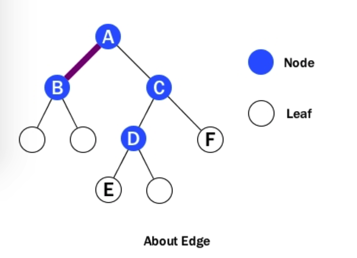
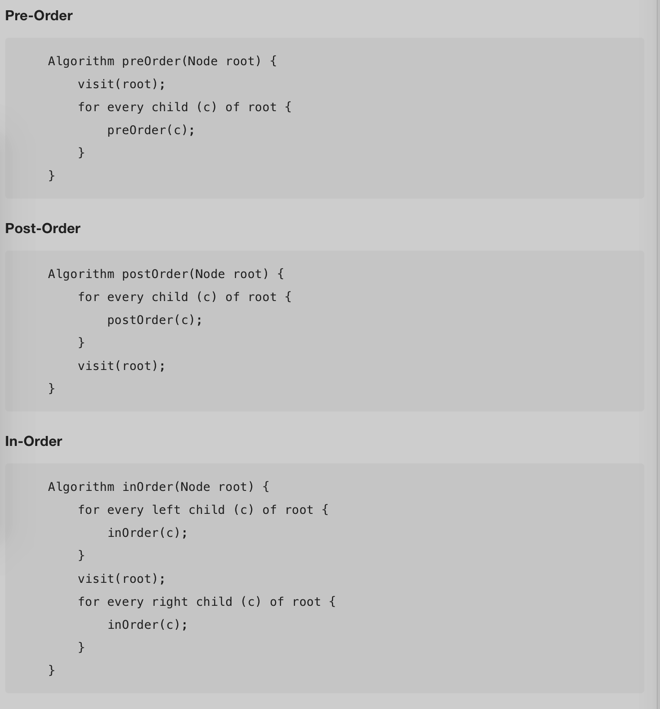

# Tree

## 定义


树的定义，树，就是一个节点(node)的集合，这些节点用父子关系来储存元素
父子关系满足以下条件：
1.  如果树非空，则有一个跟节点，它没有父节点。
2.  根节点以外的其他节点，都有切仅有一个父节点。每个节点可能有一个或多个子节点，也可能没有。

## Tree Concept
- Root: The Node at the top of the tree
- Parent: When any node(except the root) has exactly one edge running upward to another node. The node above is called parent of the node
- Child: Any node may have one or more lines running downward to other nodes. These nodes below the given node called its children.
- Edge: Connection between one node to another
- Leaf: A node that has no children is called a leaf. There can be only one root in a tree but there can be many leaves
- Levels: the level of a particular node refers to how many generations the node is from the root. The root is level 0 and its children are level 1 and so on
- Height: The height of a tree is the number of edges on the longest downward path between the root and a leaf
- Path: a sequence of nodes and edges connecting a node with a descendant

## BST二叉搜索树
能够自动给元素排序的树，就叫做二叉搜索树：
1. 每一个节点的左子树中的元素，比这个节点的元素小，或与它相等
2. 每一个节点的右子树中的元素，比这个节点的元素大，或与它相等

## 时间复杂度
- Insertion: 平均情况下是O(log(N))，大部分情况下，比排序的list快捷
- Deletion: 平均情况下比O(log(N))再多一点。先搜索到元素O(log(N))，没找到就end, 找到的情况下再分四种情况：
    - 元素是leaf parent对应指针指到null，元素的指针全部删除
    - 元素仅有左边child parent对应指针指到左child，元素的指针全部删粗
    - 元素仅有右边child parent对应指针指到右child，元素的指针全部删粗
    - 元素有左右两个children这种情况最为复杂，需要找到successor,也就是右子树中最小的元素。从要删除的元素往下一路向左，找到最左元素，定位successor,然后：
        + Successor如果有右树，将其连到其parent的左树上
        + Successor新的右树，连到被删除元素的右树上
        话费时间，除了搜索以外，还有找到Successor以及固定的relink时间
- Traversal树尤其是二叉树，BST的遍历，是一种机器重要和常见的操作。树的遍历有两种方法：深度优先遍历和广度优先遍历
    - Depth First: “先顺完一个根须，再顺其他根须”，和breadth first一层一层推进的吮吸相对。注意顺完一个往回倒掉时候是从下往上倒掉。根据parent和child的visit顺序，分为Pre/Post/in-order,就是指先visit根节点还是其children.
        + pre: 就是先根节点，后children
        + In:  就是children-根节点-右边children.所有节点都visit了一遍，所以是O(N)
    
    - Breadth First: 优先遍历完同层。用一个queue结构，先dequeue根节点q,按照层序enqueue其children,visit(q)然后dequeue顶部新根节点，继续enqueue。重复到dequeue空为止。注意中间queueu的形态。所有Node都会被enqueue和dequeue各一遍吗所以复杂度是O(2N)，即O(N).

## Breadth-First
````java
    Algorithm breadthFirst(Node root) {
        Initialize queue Q to contain root;
        while Q is not empty {
            q = Q.dequeue();
            visit(q);
            for every child of q(c) {
                Q.enqueue(c);
            }
        }
    }
````

## 二叉树这些基本操作，对应的java方法如下：
- boolean find(int key)
- void insert(int key, double value)
- void delete(int key)
- Iterator iterator()

## 具体实现
1. TreeNode嵌套类
````java
    //private static nested Node class
    private static class Node {
        int key;
        double value;
        Node left, right;

        Node(int key, double value) {
            this.key = key;
            this.value = value;
            left = right = null;
        }
    }
````
    i. boolean find(int key)
````java
    public boolean find(int key) {
        //Edge case
        if(root == null) {
            return false; //tree is empty
        }
        Node cur = root;

        //while not found 
        while(cur.key != key) {
            if (cur.key < key) {
                //go to the right child 
                cur = cur.right;
            } else {
                //go left
                cur = cur.left;
            }
            if (cur == null) {
                //not found
                return false;
            }
        }
        return true;
    }
````

1. void insert(int key, double value)注意需要记录一个parent,这样找到spot以后，可以保存其父节点的指针。
````java
    public void insert(int key, double value) {
        Node newNode = new Node(int key, value);
        //Edge Case, if tree is empty, give the newNode to the root
        if (root == null) {
            root = newNode;
        } else {
            //keep track of parent
            Node parent = root;
            Node curr = root;

            while (true) {
                //no duplicates allowed
                if (key == curr.key) {
                    return;
                }
                parent = curr;

                if (key < curr.key) {
                    //go left
                    curr = curr.left;
                    //found a spot
                    if (curr == null) {
                        parent.left = newNode;
                        return;
                    } 
                } else {
                    //go right
                    curr = curr.right;
                    if (curr == null) {
                        parent.right = newNode;
                        return;
                    }
                }
                //end of if-else to go left or right
            }
            //end of while
        }
        //end of if-else to chekc empty BST or not
    }//end of insert method
````

2. void delete(int key)
````java
    public void delete(int key) {
        //Edge Case, the tree is empty
        if (root == null) {
            return;
        }

        //Normal Case
        Node curr = root;
        //keep track of the parent
        Node parent = root;
        //flag to check left child
        boolean isLeftChild = true;

        while (curr.key != key) {
            parent = curr;
            if (curr.key > key) {
                //go left
                isLeftChild = true;
                curr = curr.left;
            } else {
                //go right
                isLeftChild = false;
                curr = curr.right;
            }

            if (curr == null) {
                //not found
                return;
            }
        }

        if (curr.left == null && curr.right == null) {
            if (curr == root) {
                root = null;
            } else if (isLeftChild) {
                parent.left = null;
            } else {
                parent.right = null;
            }
        } else if (curr.right == null) {
            //no right child
            if (curr == root) {
                root = curr.left;
            } else if (isLeftChild) {
                parent.left = curr.left;
            } else {
                parent.right = curr.left;
            }
        } else if (curr.left == null) {
            if (curr == root) {
                root = curr.right;
            } else if (isLeftChild) {
                parent.left = curr.right;
            } else {
                parent.right = curr.right;
            }
        } else {
            Node successor = getSuccessor(curr);

            if (curr == root) {
                root = successor;
            } else if (isLeftChild) {
                parent.left = successor;
            } else {
                parent.right = successor;
            }

            //need to take care of final connection with curr's left
            successor.left = curr.left;
        }
    }
````
<br>
getSuccessor(): 找到某节点下方的下一个节点(如果有的话).是右子树的最左子树。注意这里说的successor不含上面的，因为这种情况下不会有上面是successor的情况。
````java
    private Node getSuccessor(Node keyNote) {
        Node successorParent = keyNote;
        Node successor = keyNode;
        Node curr = keyNode.right;

        //move to left as far as possible in the right subtree
        while (curr != null) {
            succcessorParent = successor;
            successor = curr;
            curr = curr.left;
        }

        /*
        if successor if not the right child of the node to be deleted then need to take care of two connections in the right subtree
       */
        if (successor != keyNode.right) {
            //link the right subtree of successor to its parent on the left
            successorParent.left = successor.right;
            //the right tree of the deleted node
            successor.right = keyNode.right;
        }

        return successor;

    }
````


