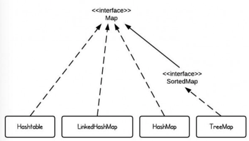

# Graph


<br>

+ HashMap is implemented as a hash table, and there is no orderding on keys or values
+ TreeMap is implemented based on red-black tree structure, and it is ordered by the key
+ LinkedHashMap preserves the insertin order
+ Hashtable is synchonized, in contrast to HashMap. It has an overhead for synchronization

This is the reason that HashMap should be used if the program is thread-safe.

# HashMap功能，方法，复杂度

1. 功能：添加，删除，搜索(提取)全部O(1)

````java
 V put(K key, V value)
 V get(Object key)
 V remove(Object key)
 Boolean containKey(Object key)
````
不能做到：定位，排序

2. Traverse方法：没有顺序怎么遍历？
   Traverse Map有四种方法
<br>
   [Traverse Map 4 method](http://blog.csdn.net/tjcyjd/article/details/11111401)
<br>

    + Iterator
    + entrySet/keySet/valueSet
    + Java中不要通过key找value来遍历(不完全是O(1))

# 实现

- 数据存放： Entry是AbstractMap中实现的，存放key, value, hash和链接到同一个hash bucket的下一个Entry的指针next.HashMap 中的HashEntry是static class，继承该类，并增加几种新的方法。

````java
static class Entry<K, V> implements Map.Entry<K, V> {
    final K key;
    V value;
    Entry<K, V> next;
    final int hash;
        //....
}
````

+ put
将定义好的key和value放进HashMap中。先计算出hash code,而后在对应链表中检查是否已存在该key.如存在，更新对应Value;如不存在，将新的entry加入该链表。

````java
    public V put(K key, V value) {
        int idx = hash(key); // get the bukcet index
        HashEntry<K, V> e = buckets[idx];

        //While this hash bukcet is not empty
        while (e != null) {
            //if the key already exists, update the value and return old value
            if (equals(key, e.key)) {
                //must call this for bookkeeping in LinkedHashMap. In HashMap, it does not do anything
                e.access();
                V r = e.value;
                e.value = value;
                return r;// return the replaced old value
            } else {
                //if the key does not esist, loop through until e is ull
                e = e.next;
            }
        }

        //At this point, we know we need to add a new entry
        modCount++; //For fail-fast
        if (++size > threshold) {
            //if there are too many key-value pairs, rehash rehash();
            //need a new hash value to suit the bigger table
            idx = hash(key);
        }

        //LinkedHashMap cannot override put(), hence this call;
        addEntry(key, value, idx, true);// add a new entry to the beginning of the bucket
        return null;// no old value so return null to show key does not exist before
    }
````

+ get
得到hash->扫描链表->key相等时取出value->没有key返回null

````java
    public V get(Object key) {
        int idx = hash(key);
        HashEntry<K, V> e = buckets[idx];
        while (e != null) {
            if (equals(s=key, e.key)) {
                return e.value;
            }
            e = e.next;
        }
        return null;
    }
````

+ containsKey
一样的扫描链表方式，扫到key以后返回true，没扫到返回false.

````java
    public boolean containsKey(Object key) {
        int idx = hash(key);
        HashEntry<K, V> e = buckets[idx];
        while(e != null) {
            if (equals(key, e.key)) {
                return true;
            }
            e = e.next;
        }

        return false;
    }
````

+ remove
扫描，找到元素并跳过它重新接续链表(若元素为第一位则需要assign bucket[idx]).
````java
    public V remove(Object key) {
        int idx = hash(key);
        HashEntry<K, V> e = buckets[idx];
        HashEntry<K, V> last = null;

        while (e != null) {
            if (equals(key, e.key)) {
                modCount++;
                if (last == null) {
                    buckets[idx] = e.next;
                } else {
                    last.next = e.next;
                }
                size--;
                //Method call necessary for LinkedHashMap to work correctly
                return e.cleanup();
            }
            last = e;
            e = e.next;
        }
        return null;
    }
````

+ resize
当加入新entry以后新size > threshold时call此函数，扩展array长度至newCapacity, java用的是2*oldCapacity. 并将旧的entries挪移到新的array中来。时间复杂度是O(N)

````java
    //the "rehash" function in JAVA 8 that directly takes the key
    static final int hash(Object key) {
        int h;
        return (key = null) ? 0 : (h = key.hashCode()) ^ (h >>> 16);
    }

    //the function that returns the index from the rehashed hash
    static int indexFor(int h, int length) {
        return h & (length - 1);
    }
````

Rehash Function in java 6(Java 8 is too long)

````java
    /*
    Rehashes the contents of this map into a new array with a larger capacity. This method is automatically when the number of keys in this map reaches its threshold. If current capacity is MAXIMUM_CAPACITY, this method does not resize the map, but sets threshold to Integer.MAX_VALUE. THis has the effect of preventing future calls.
    */
    void resize(int newCapacity) {
        Entry[] oldTable = table;
        int oldCapacity = oldTable.length;
        if (oldCapacity == MXIMUM_CAPACITY) {
            threshold = Integer.MAX_VALUE;
            return;
        }

        Entry[] newTable = new Entry[newCapacity];
        transfer(newTable);
        table = newTable;
        threshold = (int)(newCapacity * loadFactor);
    }

    /*Transfer all entries from current table to newTable*/

    void transfer(Entry[] newTable) {
        Entry[] src = table;
        int newCapacity = newTable.length;
        for (int j = 0; j < src.length; j++) {
            Entry<K, V> e = src[j];
            if (e != null) {
                src[j] = null;
                do {
                    Entry<K, V> next = e.next;
                    int i = indexFor(e.hash, newCapacity);
                    e.next = newTable[i];
                    newTable[i] = e;
                    e = next;
                } while (e != null);
            }
        }
    }
````

# 注意事项

1. No order
2. No duplicate
3. key可以是null

# HashTable
The HasMap class is roughly equivalent to Hashtable, except that it is unsynchronized and permits nulls.

## LinkedHashMap
怎么把Visitor按照来的顺序记录？保持一个Linked Structure,每来一个就连到末尾。
表现LinkedHashMap性质的代码：
````java
    public static void main(String[] args) {
        Dog d1 = new Dog("red");
        Dog d2 = new Dog("black");
        Dog d3 = new Dog("white");
        Dog d4 = new Dog("white");

        LinkedHashMap<Dog, Integer> linkedHashMap = new LinkedHashMap<Dog, Integer>();
        linkedHashMap.put(d1, 10);
        linkedHashMap.put(d2, 15);
        linkedHashMap.put(d3, 5);
        linkedHashMap.put(d4, 20);

        for(Entry<Dog, Integer> entry : linkedHashMap.entrySet()) {
            System.out.println(entry.getKey() + " - " + entry.getValue());
        }
    }
````

Output一定是：

red dog - 10
black dog - 15
white dog - 20

如果HashMap, output不一定能保持这个顺序。

# TreeMap

## 功能
那如果想对visitor按照年龄等因素进行排序呢？LinkedHashMap就不能满足了，它只能做到按put等顺序输出。

TreeMap: 仍然不可以针对value进行排序，但可以针对key进行排序。重写hashCode function就可以实现某种想要的顺序。这说明：用TreeMap的话，key必须是comparable的！可以用override comapreTo function来实现。

当我们需要对HashMap中的元素进行排序时，可以将其转换入TreeMap来排。
这段代码把Dog进行了按size的排序：
````java
class Dog implements Comparable<Dog> {
    String color;
    int size;

    Dog(String c, int s){
        color = c;
        size = s;
    }

    public String toString() {
        return color + "dog";
    }

    @override 
    public int compareTo(Dog o) {
        return o.size - this.size;
    }
}

public class testTreeMap {
    public static void main(String[] args) {
        Dog d1 = new Dog("red", 30);
        Dog d2 = new Dog("black", 20);
        Dog d3 = new Dog("white", 10);
        Dog d4 = new Dog("white", 10);

        for (Entry<Dog, Integer> entry : treeMap.entrySet()) {
            System.out.println(entry.getKey() + " - " + entry.getValue());
        }
    }
}
````

# 方法
[http://www.tutorialspoint.com/java/java_treemap_class.htm](http://www.tutorialspoint.com/java/java_treemap_class.htm)
关键：可以提取头部，尾部的key和map

# 实现及复杂度
为了能够维护顺序，用红黑树来实现(自平衡的BST).
没有用Hash所以添删搜复杂度不再保持O(1),而是Tree的O(log(N)).

# 注意事项
- 因为基于HashMap, 所以entry如果是新class要override equals()和hashCode().
- 同时，entry如果是新class也必须implement Comparable interface, overide comapreTo().
- Key不能有duplicate, 如果有的话就会替换，这点和HashMap一样。


