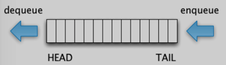

# Queue 

- LIFO: Last In First Out

## Queue实现以下功能
- enqueue(x): add an item at the tail 
- dequeue: remove the item at the head 
- peek: return the item at the head (without removing it)
- size: return the number of items in the queue
- isEmpty: return whether the queue has no items

<table>
    <tr><th>DS</th><th>Enqueue</th><th>Dequeue</th><th>Peek</th><th>size</th><th>isEmpty</th></tr>
    <tr><td>Queue</td><td>O(1)</td><th>O(1)</th><th>O(1)</th><th>O(1)</th><th>O(1)</th></tr>
</table>

## 对应的JAVA方法，因为JAVA里没有Queue Class， 而是使用LinkedList来implement Queue interface

- add(Object obj): inserts the specified element into this queue. Returns true if queue changed after the oeration otherwise return false.
- offer(Object obj): inserts the specified element into this queue. Returns true if the element was added to this queue otherwise returns false.
- remove(): returns and removes the head of this queue. It throws an exception if this queue is empty.
- poll(): Returns and removes the head of the queue. Returns null if this queue is empty.
- element(): returns but does not removes the head of this queue. It throws an exception if this queue is empty.
- peek(): returns but does not removes the head of this queue. Returns null if this queue is empty.

## 具体实现方法

1. LinkedList实现Queue，和实现Stack类似，但是更复杂。因为Stack是在同一头操作，而LinkedList不是。如果我们把排队操作放在list尾部，拍到了就从头部删除，那么要enqueue就得先traverse到尾部，时间O(N),没效率。如何改进呢？保持一个到尾部的Node: rear即可。每次enqueue, 用rear.next把newNode连上，然后rear=newNode. dequeue直接弹head的data,然后head= head.next.
2. Array
   用Array实现Queue,就复杂一些。我们可以使用一个数组，维护从头尾两个位置。添加在尾端，提取在头端，循环流动。而头端和尾端相碰的时候，就需要Resize. 从头到尾复制到心的内存空间中，将原来的空间舍弃。

### Things to note here.
- The capacity is set at creation time
- Adds have a precondition that the queue isn't already full
- Adding to a full queue is a state exception, not an argument exception
- The array itself is effectively circualr 
- WHen removing, we take care to nullify the newly unused slot in the array to prevent a possible memory leak

### 这里最值得注意的就是循环的方式，head = tail % arr.length 

3. Stack (LeetCode: Implement Queue Using Stacks)
   

