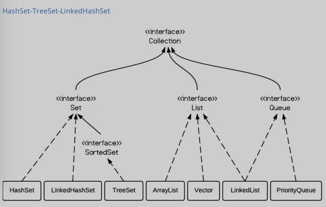

# Set


# HashSet
## 问题与原理

- 什么是Set?
A set is an abstract data type taht can store certain values, without any particular order, and no repeated values.
    + No order
    + No repeat

- 为何用Hashing来查重
快速add/remove/contains(search):O(1).

- 功能／方法／复杂度
<table>
    <tr><th>Methods</th><th>Complexity</th></tr>
    <tr><th>add(Object o)</th><th>O(1)</th></tr>
    <tr><th>remove(Obejct o)</th><th>O(1)</th></tr>
    <tr><th>contains(Object o)</th><th>O(1)</th></tr>
</table>
    1. 没有顺序，所以无法排序
    2. 不能重复
    3. 无法定位
    4. 用iterator()来遍历

- 实现
    + 底层结构： 用一个HashMap来实现，但value部分用dummy object, 只保留key.
    + it stores and retrieves elements by using a hash function that converts elements into an integer.
    + 如果重复，和HashMap一样会替换，但因为value都是dummy, 所以不会发生变化.

````java
public class HashSet<E> implements Set<E> {
    private HashMap<E, Object> map;
    //Dummy value to associate with an Object in the backing Map
    private static final Object PRESENT = new Object();

    public HashSet() {
        map = new HashMap<>();
    }

    public boolean add(E e) {
        return map.put(e, PRESENT) == null;
    }
}
````

## 应用及注意事项
1. No order
2. No duplicate

## TreeSet
### 问题与原理
但是，如果我希望这个Set有顺序，能够被排序，怎么办呢？

红黑树， Red-black tree: 自平衡的BST.

[红黑树](http://www.geeksforgeeks.org/red-black-tree-set-1-introduction-2/)

- 功能／方法／复杂度
因为是平衡树，所以各个主要操作都是O(log(n)).

TreeSet is implemented using a tree structure(red-black tree in algorithm book). THe elements in a set are sorted, but the add, remove, add contains methods has time complexity of O(log(n)). It offers several methods to deal with the ordered set like first(), last(), headSet(), tailSet(). etc.

- 实现
- 应用及注意事项
    + it is generally faster to add elements to a HashSet. And, if you need to traverse the elements in sorted order, convertthe collection to a TreeSet
    + TreeSet有顺序，所以内含的类必须要implement Comparable

- HashSet vs TreeSet vs LinkedHashSet
There are 3 commonly used implementations of Set: HashSet, TreeSet and LinkedHashSet.
When and which to use is an important question, In brief, if you need a faster set, you should use HashSet; if you need a sorted set, then TreeSet should be used; if you need s set that can be store the insertion order, linkedHashSet should be used.
    + HashSet is implemented using a hash table. Elements are not ordered. The add, remove, and contains methods have constant time complexity O(1).
    + TreeSet is implemented using a tree structure(red-black tree in algorithm book). The elements in a set are sorted, but the add remove, and contains methods has time complexity of O(log(n)). It offers several methods to deal with the ordered set like first(), last(), headSet(), tailSet(), etc.
    + LinkedHashSet is between HashSet and TreeSet. It is implemented as a hash table with a linked list running through it, so it provides the order of insertion. The time complexity of basic methods is O(1).


